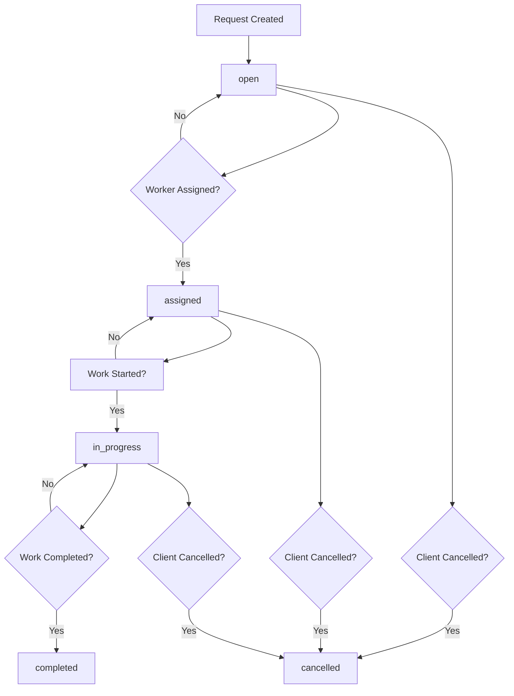

# Request Management Documentation

## 📋 Request Status Lifecycle

This document outlines the complete lifecycle of service requests (demandes) in the AlloBrico platform, including all possible statuses, transitions, and assignee information.

### Status Definitions

| Status | Description | Color | Icon |
|--------|-------------|-------|------|
| `open` | Request is published and available for workers to bid on | 🟢 Green | Clock |
| `assigned` | Request has been assigned to a specific worker | 🔵 Blue | UserCheck |
| `in_progress` | Work has started and is currently being performed | 🟡 Yellow | Wrench |
| `completed` | Work has been finished successfully | ✅ Green | CheckCircle |
| `cancelled` | Request has been cancelled by client or admin | ❌ Red | XCircle |

### Request Lifecycle Flow



### Status Transition Rules

#### From `open`:
- **To `assigned`**: When a worker accepts the request
- **To `cancelled`**: When client cancels before assignment

#### From `assigned`:
- **To `in_progress`**: When worker starts work
- **To `cancelled`**: When client or worker cancels after assignment

#### From `in_progress`:
- **To `completed`**: When work is finished
- **To `cancelled`**: When work is cancelled mid-progress

#### From `completed`:
- No further transitions (final state)

#### From `cancelled`:
- No further transitions (final state)

## 👤 Assignee Information

For requests with status `assigned`, `in_progress`, or `completed`, detailed assignee information is available.

### Assignee Data Structure

```typescript
interface RequestAssignee {
  id: string;
  name: string;
  email: string;
  phone?: string;
  avatar?: string;
  specialty: string;
  rating: number;
  jobs: number;
  type: 'individual' | 'company';
  location: string;
  description?: string;
  experience: string;
  certifications: string[];
  portfolio: string[];
  reviews: Review[];
  availability: string;
  responseTime: string;
  completedProjects: number;
  specialties: string[];
  status: 'available' | 'busy';
}
```

### Accessing Assignee Information

#### API Endpoint
```
GET /api/requests/{requestId}/assignee
```

#### Response Example
```json
{
  "data": {
    "id": "a41108ea-31ac-4f0a-a87d-c49996d6af35",
    "name": "Lucas Garcia",
    "specialty": "Menuiserie",
    "rating": 4.9,
    "jobs": 203,
    "type": "artisan",
    "location": "Paris et banlieue",
    "description": "Menuisier ébéniste pour tous travaux de bois et agencement.",
    "experience": "200+ ans",
    "certifications": ["BTS menuiserie", "Assurance décennale"],
    "availability": "Disponible",
    "responseTime": "Répond en moyenne en 2h",
    "completedProjects": 203,
    "specialties": ["menuiserie", "ébénisterie", "agencement", "rénovation bois"],
    "status": "available"
  }
}
```

### Frontend Integration

#### React Hook Usage
```typescript
const { request, assignee, loading } = useRequestWithAssignee(requestId);

// assignee will be null for 'open' requests
// assignee will contain full profile for 'assigned', 'in_progress', 'completed' requests
```

#### Component Example
```tsx
const RequestCard = ({ request }: { request: ServiceRequest }) => {
  return (
    <Card>
      <CardHeader>
        <CardTitle>{request.title}</CardTitle>
        <Badge variant={getStatusVariant(request.status)}>
          {getStatusLabel(request.status)}
        </Badge>
      </CardHeader>

      {request.assignedWorkerId && (
        <CardContent>
          <AssigneeInfo
            assigneeId={request.assignedWorkerId}
            status={request.status}
          />
        </CardContent>
      )}
    </Card>
  );
};
```

#### Assignee Profile Link
```tsx
const AssigneeInfo = ({ assigneeId, status }: { assigneeId: string; status: RequestStatus }) => {
  const { assignee } = useAssignee(assigneeId);

  if (!assignee) return null;

  return (
    <div className="assignee-info">
      <Avatar src={assignee.avatar} />
      <div>
        <Link to={`/workers/${assignee.id}`}>
          <h4>{assignee.name}</h4>
        </Link>
        <p>{assignee.specialty}</p>
        <div className="rating">
          <Star rating={assignee.rating} />
          <span>({assignee.jobs} jobs)</span>
        </div>
        {status === 'in_progress' && (
          <Badge variant="secondary">Currently Working</Badge>
        )}
      </div>
    </div>
  );
};
```

## 🔄 Status Change Notifications

### Automatic Notifications

| Status Change | Notification Type | Recipients |
|----------------|-------------------|------------|
| `open` → `assigned` | Assignment Confirmation | Client, Worker |
| `assigned` → `in_progress` | Work Started | Client |
| `in_progress` → `completed` | Work Completed | Client, Worker |
| Any → `cancelled` | Cancellation Notice | Client, Worker (if assigned) |

### Notification Content

#### Assignment Notification
```json
{
  "type": "request_assigned",
  "title": "Demande assignée",
  "message": "Votre demande '{request.title}' a été assignée à {worker.name}",
  "actionUrl": "/requests/{request.id}",
  "metadata": {
    "requestId": "uuid",
    "workerId": "uuid",
    "workerName": "string"
  }
}
```

#### Work Started Notification
```json
{
  "type": "work_started",
  "title": "Travaux commencés",
  "message": "{worker.name} a commencé les travaux pour '{request.title}'",
  "actionUrl": "/requests/{request.id}",
  "metadata": {
    "requestId": "uuid",
    "workerId": "uuid"
  }
}
```

## 📊 Request Statistics

### Status Distribution
```typescript
interface RequestStats {
  total: number;
  open: number;
  assigned: number;
  in_progress: number;
  completed: number;
  cancelled: number;
  averageCompletionTime: number; // in days
  averageResponseTime: number; // in hours
}
```

### Assignee Performance Metrics
```typescript
interface AssigneeMetrics {
  workerId: string;
  totalAssigned: number;
  completionRate: number; // percentage
  averageRating: number;
  averageCompletionTime: number; // in days
  clientSatisfaction: number; // average rating
}
```

## 🔧 API Endpoints

### Get Request with Assignee
```
GET /api/requests/{id}?include=assignee
```

### Update Request Status
```
PATCH /api/requests/{id}/status
Content-Type: application/json

{
  "status": "in_progress",
  "notes": "Work has begun on site"
}
```

### Assign Worker to Request
```
POST /api/requests/{id}/assign
Content-Type: application/json

{
  "workerId": "uuid",
  "assignedBy": "uuid",
  "notes": "Worker assigned based on availability and skills"
}
```

### Get Assignee Profile
```
GET /api/workers/{id}/profile
```

## 🎨 UI/UX Guidelines

### Status Indicators
- **Open**: Green badge with clock icon
- **Assigned**: Blue badge with user-check icon
- **In Progress**: Yellow badge with wrench icon
- **Completed**: Green badge with check-circle icon
- **Cancelled**: Red badge with x-circle icon

### Assignee Display
- Show assignee avatar, name, specialty, and rating
- Link to full worker profile
- Display current work status for active assignments
- Show contact information for assigned workers

### Status Change Actions
- Clients can cancel `open` and `assigned` requests
- Workers can mark `assigned` requests as `in_progress`
- Workers can mark `in_progress` requests as `completed`
- Admins can change any status with appropriate permissions

## 🔐 Permissions

### Client Permissions
- View all their requests
- Cancel `open` and `assigned` requests
- Rate completed work

### Worker Permissions
- View assigned requests
- Update status from `assigned` to `in_progress`
- Update status from `in_progress` to `completed`
- Cannot cancel requests (only clients can)

### Admin Permissions
- View all requests
- Change any request status
- Assign workers to requests
- Cancel any request
- Access all assignee information

## 📱 Mobile Considerations

### Status Display
- Use color-coded badges for quick status recognition
- Show abbreviated status labels on small screens
- Stack assignee info vertically on mobile

### Assignee Actions
- Touch-friendly assignee profile links
- Quick contact actions for assigned workers
- Swipe gestures for status updates (future enhancement)

---

*This documentation covers the complete request lifecycle management system. For implementation details, refer to the API documentation and frontend component libraries.*</content>
<parameter name="filePath">/Volumes/Data/React/allobbrico-fullstack/docs/request-management.md